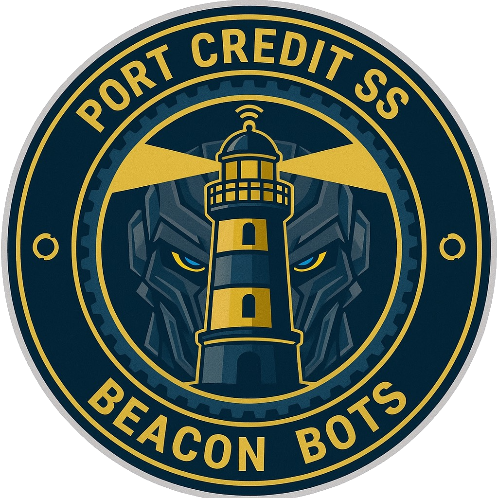

# FRC Team 11348 - BeaconBots Website

**Official website for FRC Team 11348 - BeaconBots, a FIRST Robotics Competition team dedicated to inspiring the next generation of innovators through competitive robotics and STEM education.**
Moved to new location



## 🤖 About Team 11348 - BeaconBots

FRC Team 11348, known as the **BeaconBots**, is a competitive robotics team participating in the FIRST Robotics Competition (FRC). We are a community of students, mentors, and volunteers passionate about engineering, innovation, and spreading STEM education.

### Our Mission
To create a world where every student has the opportunity to discover their potential through hands-on STEM education and collaborative problem-solving.

### Our Values
We value **Gracious Professionalism®**, cooperation, innovation, and inclusion. We believe that learning should be fun, challenging, and accessible to all.

## 🌐 Website Overview

This is the official website for Team 11348 - BeaconBots, built with modern web technologies to showcase our team, robots, achievements, and community involvement.

### Features
- **Responsive Design**: Fully responsive layout that works on all devices
- **Modern UI/UX**: Clean, professional design with smooth animations and transitions
- **Interactive Navigation**: Dropdown menus and mobile-friendly navigation
- **Team Showcase**: Comprehensive team member profiles and subteam information
- **Robot Gallery**: Detailed showcase of our competition robots and their achievements
- **Join Form**: Interactive application form for prospective team members
- **Contact Information**: Easy ways to get in touch with our team

## 📁 Project Structure

```
FRC/
├── index.html          # Homepage with hero section and features
├── about.html          # About us, mission, and values
├── team.html           # Team members and subteams
├── robots.html         # Competition robots showcase
├── sponsors.html       # Our sponsors and partners
├── join.html           # Join our team application form
├── contact.html        # Contact information and form
├── 404.html            # Custom 404 error page
├── wip.html            # Work in progress page
├── robots.html         # Previous robots and achievements
├── icon.png            # Team logo/favicon
├── logo.jpeg           # Team logo
├── update_favicons.js  # Utility script for favicon management
├── .htaccess           # Apache server configuration
└── README.md           # This file
```

## 🎨 Design & Technology

### Technologies Used
- **HTML5**: Semantic markup for accessibility and SEO
- **CSS3**: Modern styling with CSS Grid, Flexbox, and custom properties
- **JavaScript**: Interactive features and form handling
- **Font Awesome**: Icon library for UI elements
- **Google Fonts**: Orbitron and Inter typography

### Design Features
- **Color Scheme**: 
  - Primary Blue: `#0033A0`
  - Secondary Gold: `#FFD700`
  - Dark Background: `#0a0a0f`
- **Responsive Design**: Mobile-first approach with breakpoints at 768px and 1024px
- **Animations**: Smooth transitions and hover effects using CSS cubic-bezier functions
- **Accessibility**: Semantic HTML5, ARIA labels, and keyboard navigation support

## 🚀 Key Sections

### Homepage (`index.html`)
- Hero section with team introduction
- Feature cards showcasing team strengths
- Call-to-action buttons for joining and contacting
- Modern footer with social links

### About Us (`about.html`)
- Team mission and vision
- Core values and principles
- Team history and achievements
- Community involvement

### Team (`team.html`)
- Leadership team profiles
- Subteam descriptions (Mechanical, Electrical, Programming, etc.)
- Mentor and alumni information
- Team organization structure

### Robots (`robots.html`)
- Competition robot showcase
- Technical specifications
- Achievement highlights
- Season-by-season progression

### Join (`join.html`)
- Interactive application form
- Team requirements and expectations
- Benefits of joining
- Next steps for applicants

## 🤝 Getting Involved

### How to Join
1. Visit our [Join Page](join.html)
2. Fill out the application form
3. Attend our team meetings
4. Complete the onboarding process

### Contact Us
- **Email**: [Available on contact page](contact.html)
- **Social Media**: 
  - [Instagram](https://www.instagram.com/frc11348)
  - [GitHub](https://github.com/Team-11348)
- **Location**: [Available on contact page](contact.html)

## 🏆 Competition History

Each season represents months of hard work, dedication, and learning from our students and mentors.

## 🔧 Development

### Local Development
To run this website locally:
1. Clone the repository
2. Open `index.html` in your web browser
3. No build process required - static HTML/CSS/JS

### Browser Support
- Chrome/Chromium (Recommended)
- Firefox
- Safari
- Edge

### Mobile Support
- iOS Safari 12+
- Chrome Mobile
- Samsung Internet

## 📝 Contributing

For contributions or suggestions:

1. Fork the repository
2. Create a feature branch
3. Make your changes
4. Submit a pull request

## 📄 License

This project is open source and available under the [MIT License](LICENSE).

## 🔗 Links

- **Official FRC Website**: [firstinspires.org](https://www.firstinspires.org/robotics/frc)
- **Team GitHub**: [github.com/Team-11348](https://github.com/Team-11348)
- **FIRST Robotics**: [About FRC](https://www.firstinspires.org/robotics/frc)

---

**© 2025 FRC Team 11348 - BeaconBots. All rights reserved.**

*Made with ❤️ by Team 11348*

---

*This website represents the hard work and dedication of all Team 11348 members, mentors, and volunteers who contribute to making STEM education accessible and exciting for students in our community.*
